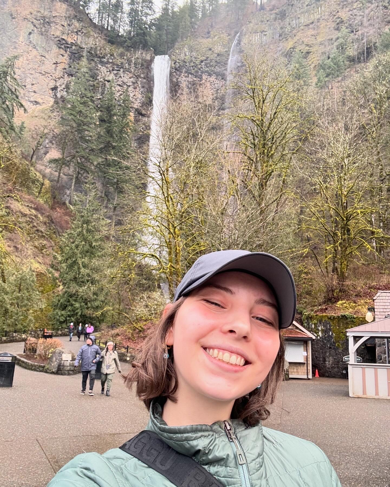
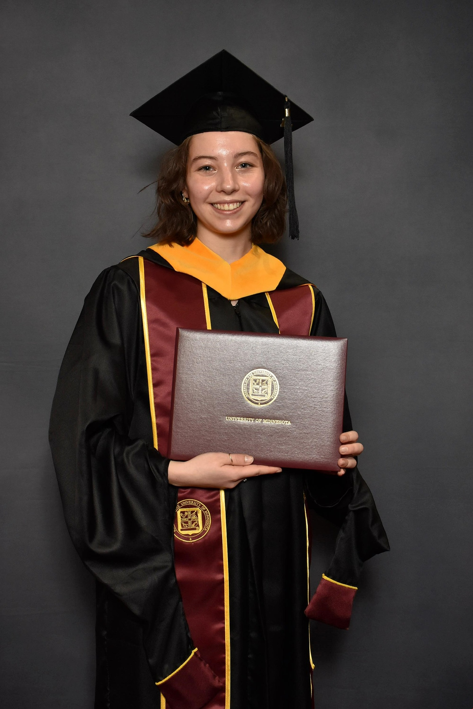

<!-- Bio Section -->

  
  

    
Hi, I'm Kathryn — a data scientist and analyst with a passion for turning complex information into clear, actionable insights. I have a Master’s degree in Bioinformatics and Computational Biology and hands-on experience building machine learning models, designing interactive dashboards, and conducting large-scale analytics projects. Skilled in Python, R, SQL, and visualization tools like Tableau and PowerBI, I enjoy working at the intersection of data, research, and real-world impact. Whether visualizing trends or developing machine learning models, I’m dedicated to making data approachable, actionable, and impactful.

  

<h2>About</h2>

  <a class="mini-card" href="https://linkedin.com/in/kfillman" target="_blank">
    
    
Connect with me

  </a>

  

    
    
Avid hiker

  

  
  

    
    
Recent grad

  

  

